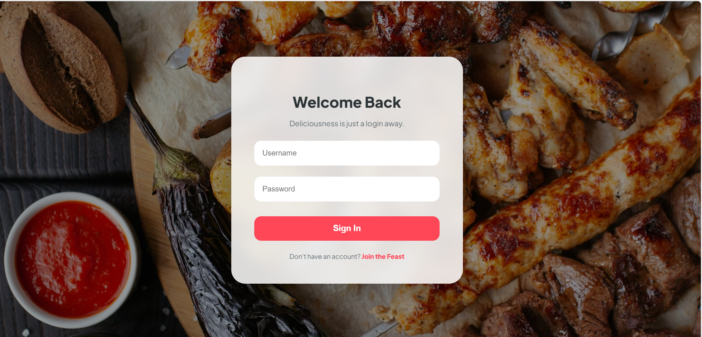
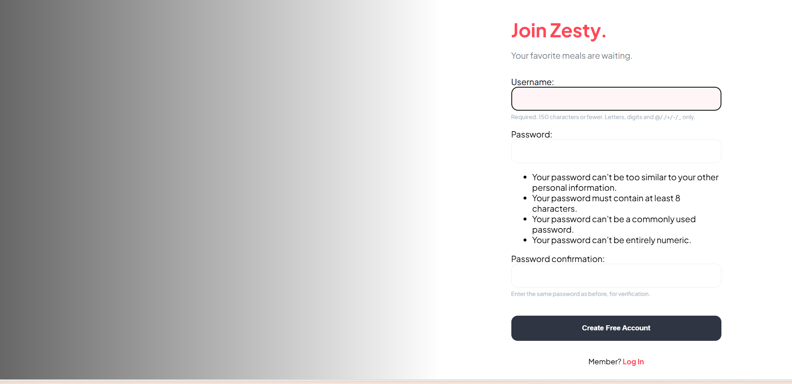
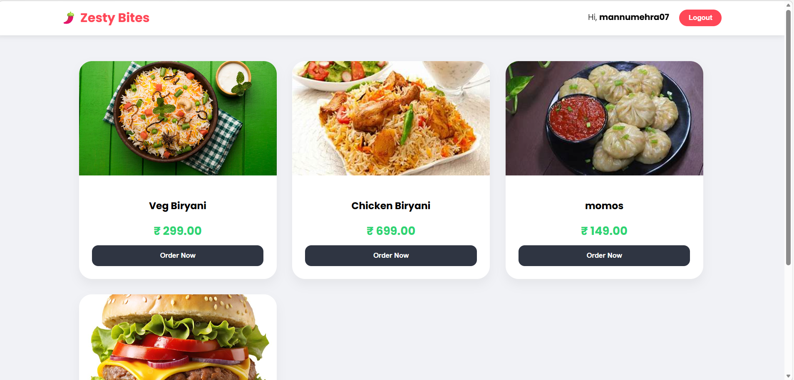

# 🍔 Zesty Bites - Food Ordering System

A premium Django-based food ordering platform featuring a "Login-First" architecture, dynamic menu management, and professional-grade security configurations.

---

## 📸 Project Showcases

| Login Page (Landing) | Signup Page | Dynamic Food Menu |
| :---: | :---: | :---: |
|  |  |  |

> *Note:* Please ensure your screenshots are saved in a folder named screenshots/ in the root directory for these to display on GitHub.

---

## ✨ Key Features

* *Authentication-First Routing:* The application root ('') is mapped directly to the *Login Page*, ensuring a secure entry point for all users.
* *Dynamic Image Rendering:* Utilizes Django's MEDIA_ROOT and MEDIA_URL configurations to serve food item images dynamically from the server.
* *Secure Environment Management:* Sensitive credentials like the SECRET_KEY are decoupled from the codebase using .env files and python-dotenv.
* *Smart Redirects:* Seamlessly transitions users from Login to the Menu page upon successful authentication.

---

## 🛠️ Technical Implementation

### *Backend Architecture*
* *Core Logic:* Django (Python)
* *Database:* SQLite (Development)
* *Environment Control:* Python-Dotenv

### *Security Best Practices*
The project implements a strict .gitignore policy to prevent sensitive files like db.sqlite3, __pycache__, and .env from being exposed in public repositories.

---

## 🚀 Installation & Local Setup

### 1. Clone & Environment
```bash
git clone [https://github.com/YOUR_USERNAME/Food_Ordering.git](https://github.com/YOUR_USERNAME/Food_Ordering.git)
cd Food_Ordering
python -m venv venv
# Activate on Windows:
venv\Scripts\activate

### 2. Dependencies & Security
Install the required packages and set up your secret vault:
```bash
pip install -r requirements.txt

🔑 Crucial Step: Create a file named .env in the root directory (where manage.py is) and add your secret key.
SECRET_KEY=your_django_secret_key_here

### 3. Initialize Database & Run
python manage.py migrate
python manage.py runserver

​📂 Folder Structure
​core/: Root configuration and URL dispatching.
​food/: Application logic including views, models, and custom templates.
​media/: Dynamic storage for food item assets.
​screenshots/: UI previews for documentation.
