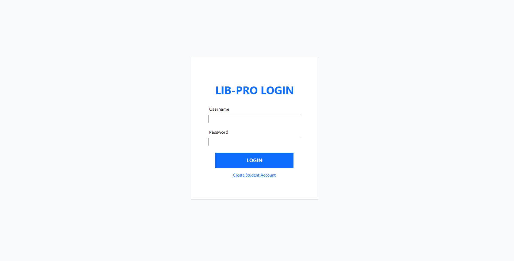
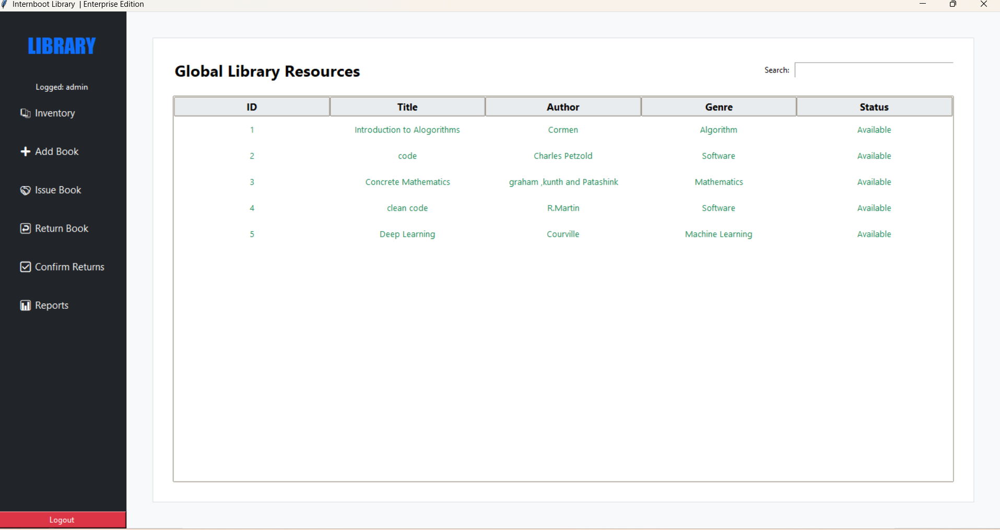
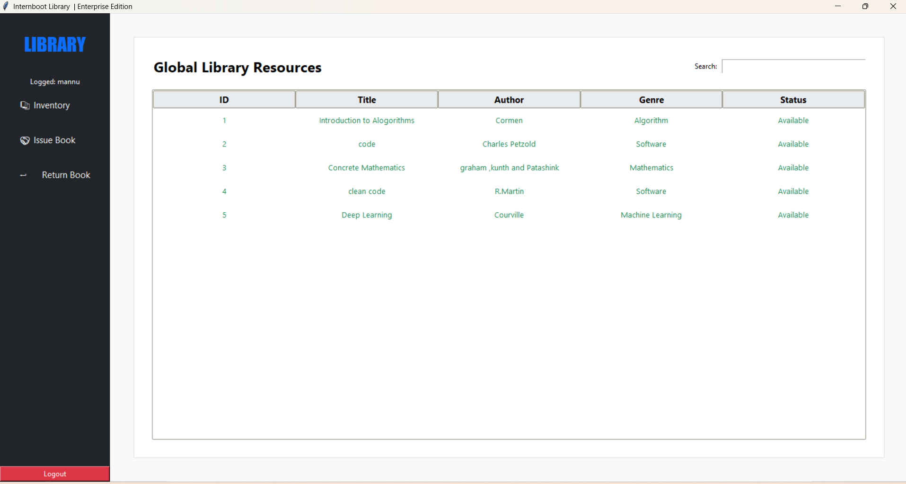

# 📚 Library Pro | Enterprise Edition 

A professional-grade Library Management System developed for *Internboot Projects. This application implements **Role-Based Access Control (RBAC)* to provide secure, customized experiences for Administrators and Students, ensuring data integrity through a centralized verification workflow.

---

## 🚀 System Features
* *Dual-Role Architecture*: Distinct interfaces for Administrators and Students.
* *Admin Verification Desk*: A mandatory security layer for book returns.
* *Real-time Inventory Control*: Live search and status tracking via SQLite.
* *Automated Penalty Logic*: Integrated fine calculation for overdue resources.
* *Modern UI/UX*: High-contrast, card-based interface built with Python Tkinter.

---

## 📸 System Walkthrough

### 1. Secure Login Portal
The gateway to the system. Handles encrypted-style authentication and role assignment for users and staff.


### 2. Administrator Dashboard
The command center for library staff. Includes tools for inventory management, return approvals, and CSV reporting.


### 3. Student Self-Service Portal
A streamlined interface for students to discover resources, track their borrowed books, and monitor pending fines.


---

## 🛠️ Technical Specifications
* *Language*: Python 3.10+
* *Database*: SQLite (Relational Schema v5.0)
* *GUI Library*: Tkinter (Modular Frame Design)
* *Reporting*: CSV Export Functionality

---
## 🛠️ Installation
1. Clone this repository.
2. Create and activate a virtual environment:
   ```bash
   python -m venv venv
   source venv/bin/activate  # On Windows use venv\Scripts\activate
   ```
3. Install Dependencies
```bash
   pip install -r requirements.txt
   ```
4. Run
```bash
   python main.py
   ```
---
Developed for Internboot | March 2026
   python main.py
