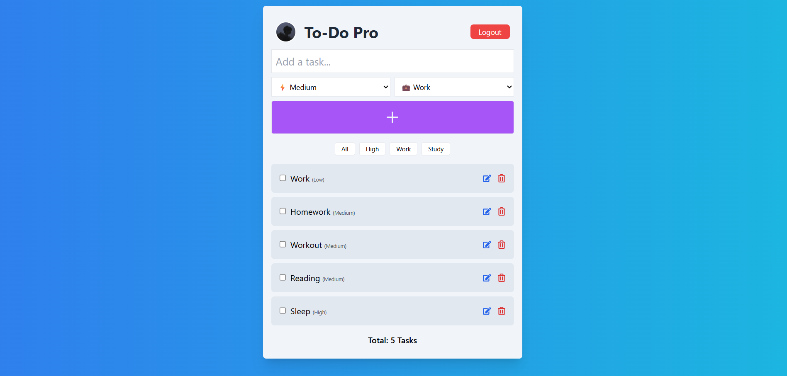

#  Task Management 

A real-time, secure Task Management application built during my internship at *Internboot. This project fulfills the requirements for the **Beginner Level Task (Part 04)*, featuring full CRUD operations, task organization, and secure authentication.

## 🖼️ Interface


## 🚀 Features
* *Google Authentication*: Secure login and session persistence using Firebase Auth.
* *Real-time CRUD*: Create, Read, Update (Edit), and Delete tasks synced with Firestore.
* *Task Organization: Categorize tasks into **Work, Personal, or Study*.
* *Priority Tracking: Assign **High, Medium, or Low* priority to every task.
* *Smart Filtering*: Filter tasks by category or priority level for better focus.
* *Protected Routes*: Ensuring only authenticated users can access the dashboard.
* *Logout Functionality*: Ability to securely end the session and clear tokens.

## 🛠️ Installation & Setup

Follow these steps to run the project locally:

1. *Clone the repository:*
   ```bash
   git clone [https://github.com/YOUR_GITHUB_USERNAME/Internboot.git](https://github.com/YOUR_GITHUB_USERNAME/Internboot.git)
   cd Internboot
2. install dependencies
  ```bash
     npm install
   ```
3. Run the application
```bash
    npm start
```
